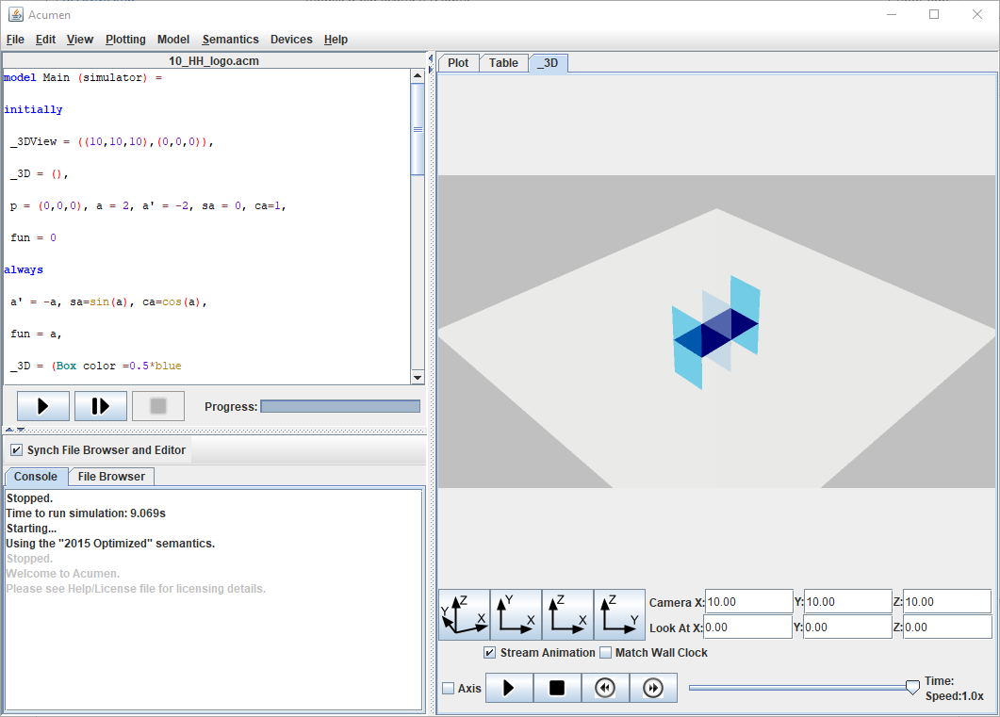

# [Acumen](http://www.acumen-language.org/) &middot; 

An intuitive tool for simulating mathematical models of cyber-physical systems and for visualizing them as plots or in 3D. Students as young as eight years and up to the PhD level use it to learn STEM subjects. Researchers use it to develop better CPS technologies.

## Demo

## Table of contents

* [Getting Started](#getting-started)
  * [Prerequisites](#prerequisites)
  * [Running](#running)
  * [Compiling](#compiling)
  * [Deployment](#deployment)
* [Contributing](#contributing)
* [Release Notes](#release-notes)
* [Support](#support)
* [License](#license)

## Getting Started

### Prerequisites

* You will need any OS able to run Java like Windows, Linux or OSX
* You must have **[Java JDK 8][java]** installed
* You must have **[Node.js][nodejs]** installed
* You will also need an editor (like **[VS Code][vscode]**) or an IDE (like **[IntelliJ][intellij]**)

### Running

You can run Acumen in two ways:

The first one launches the graphical interface of Acumen. You can either:

* Double click on the provided jar file.
* Or type in the command line: `java -jar acumen-VERSION.jar`

There is also a command line interface intended for advanced users. Documentation for this mode can be found by invoking Acumen from the command line. Assuming that the name of the Acumen jar file is acumen.jar, the command is as follows:

`java -jar acumen.jar --help`

### Compiling

To compile from source you need to install SBT.

1) First navigate to the following website: <https://www.scala-sbt.org/>
2) Download the latest version of the sbt tool.
3) Install the tool.

Then to compile and run acumen use:

1) Open a command line window.
2) Change directory to acumen's root folder.
3) Use `node server` to start the javascript server.
4) Open a command line window to the same folder.
5) Use `sbt run` to start the compilation process.

### Deployment

In order to deploy a runnable .jar file follow these steps:

1) Open a command line window.
2) Change directory to acumen's root folder.
3) Use `sbt assembly`, which will create a jar file in target/scala-2.11/acumen-VERSION.jar.

To do more, read up on how to use sbt at <http://www.scala-sbt.org/.>

## Contributing

Read our [CONTRIBUTING](CONTRIBUTING.md) to learn about how to propose bug fixes and improvements.

## Release Notes

To check all the release notes, see the [RELEASE-NOTES](RELEASE-NOTES.md) file.

## Support

If you cannot get acumen started please email help@acumen-language.org with the following information:

1) The acumen version you are using (which should be part of the name of the jar file).
2) The name of the OS that you are using (Windows, Mac OS, etc)
3) Any specific version information you might have about the OS
4) The version of Java you are using. To check which version of Java you have, open a command line window and type in `java -version`.
5) (Optional) If you are having problem with a particular model rather than getting acumen started, then also include the code you where trying to execute

We welcome your feedback on ways to make Acumen better, please send and bug reports are just general suggestions using the form found at:

<http://www.acumen-language.org/p/report-bug.html>

## License

 Acumen is distributed as free, open-source software under a BSD licence. See the [LICENSE](LICENSE) file for more details.

[java]: https://www.java.com/en/download/
[nodejs]: https://nodejs.org/en/
[vscode]: https://code.visualstudio.com/
[intellij]: https://www.jetbrains.com/idea/
